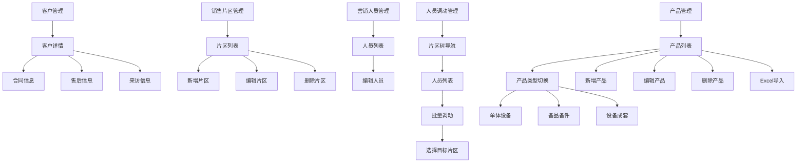

## 1. 产品概述

重泵公司客户关系管理系统，用于管理客户信息、合同、售后、来访记录、销售片区、营销人员以及产品设备等基础信息。系统帮助销售团队高效管理客户全生命周期，提升客户服务质量和销售效率。

## 2. 核心功能

### 2.1 用户角色

| 角色    | 注册方式    | 核心权限           |
| ----- | ------- | -------------- |
| 销售人员  | 管理员分配账号 | 管理客户信息、合同、售后记录 |
| 销售主管  | 管理员分配账号 | 管理销售片区、查看团队数据  |
| 系统管理员 | 初始账号    | 系统配置、用户权限管理    |

### 2.2 功能模块

系统包含以下主要功能页面：

1. **客户管理页面**：客户列表、客户详情（包含合同信息、售后信息、来访信息标签页）
2. **销售片区管理页面**：片区列表、新增/编辑片区
3. **营销人员管理页面**：人员列表、编辑人员信息
4. **人员调动管理页面**：树形片区导航、人员批量调动
5. **产品管理页面**：单体设备、备品备件、设备成套管理，支持列表、新增/编辑、Excel导入
6. **系统管理页面**：用户权限、部门管理等
6. **系统管理页面**：用户权限、部门管理等

### 2.3 页面详情

| 页面名称   | 模块名称    | 功能描述                          |
| ------ | ------- | ----------------------------- |
| 客户管理   | 客户列表    | 显示客户基本信息列表，支持搜索和筛选            |
| 客户详情   | 合同信息标签页 | 显示客户相关合同：合同名称、编号、区域、时间、备注     |
| 客户详情   | 售后信息标签页 | 显示客户售后服务记录：合同编号、名称、区域、售后人员、备注 |
| 客户详情   | 来访信息标签页 | 显示客户来访记录：客户序号、名称、状态、日期、备注     |
| 销售片区管理 | 片区列表    | 显示销售片区信息：片区名称、编号、上级部门、创建日期、备注 |
| 销售片区管理 | 新增片区    | 录入片区编号、名称、上级部门、创建时间、备注信息      |
| 销售片区管理 | 编辑片区    | 修改片区基本信息                      |
| 销售片区管理 | 删除片区    | 删除选中的片区（需确认）                  |
| 营销人员管理 | 人员列表    | 显示营销人员信息：姓名、性别、生日、联系方式、所属片区、职务 |
| 营销人员管理 | 编辑人员    | 修改营销人员基本信息                      |
| 人员调动管理 | 片区树导航   | 树形结构显示部门-片区层级关系               |
| 人员调动管理 | 人员列表    | 显示当前片区人员：姓名、工号、联系方式、职务     |
| 人员调动管理 | 批量调动    | 选择多个人员，弹出对话框选择目标片区进行调动     |
| 产品管理    | 单体设备列表  | 显示单体设备信息：名称、型号、尺寸、重量、交货周期、附件、备注 |
| 产品管理    | 备品备件列表  | 显示备品备件信息：名称、型号、尺寸、重量、交货周期、附件、备注 |
| 产品管理    | 设备成套列表  | 显示设备成套信息：名称、型号、尺寸、重量、交货周期、附件、备注 |
| 产品管理    | 新增产品    | 录入产品基本信息（根据类型显示不同字段）和附件    |
| 产品管理    | 编辑产品    | 修改产品信息（根据类型显示不同字段）          |
| 产品管理    | 删除产品    | 删除选中的产品（需确认）                  |
| 产品管理    | Excel导入   | 通过Excel文件批量导入产品信息              |
| 产品管理    | 产品类型切换 | 在列表页面切换显示单体设备、备品备件、设备成套   |

## 3. 核心流程

### 客户管理流程

1. 用户进入客户管理页面，查看客户列表
2. 点击客户名称进入客户详情页面
3. 在详情页面可切换查看合同信息、售后信息、来访信息
4. 各标签页显示对应的关联数据

### 销售片区管理流程

1. 用户进入销售片区管理页面
2. 查看片区列表，可选择片区进行编辑或删除
3. 点击"新建"按钮创建新片区
4. 填写片区信息后保存

### 营销人员管理流程

1. 用户进入营销人员管理页面
2. 查看人员列表，显示基本信息
3. 点击"修改"按钮编辑人员信息
4. 保存修改后更新列表

### 人员调动管理流程

1. 用户进入人员调动管理页面
2. 左侧树形导航选择目标片区
3. 右侧显示当前片区人员列表
4. 选择需要调动的人员（可多选）
5. 点击"调动人员"按钮
6. 弹出选择目标片区对话框
7. 选择新片区后确认调动

### 产品管理流程

1. 用户进入产品管理页面
2. 通过标签页切换查看单体设备、备品备件、设备成套列表
3. 可进行新增、修改、删除操作
4. 支持Excel文件批量导入产品信息
5. 新增/编辑时根据产品类型显示相应字段

## 4. 用户界面设计

### 4.1 设计风格

* **主色调**：蓝色系（#1890ff）为主色调，灰色系为背景

* **按钮样式**：圆角矩形按钮，主要操作为蓝色，危险操作为红色

* **字体**：微软雅黑，正文字号14px，标题字号16-18px

* **布局风格**：卡片式布局，顶部导航栏，左侧菜单栏

* **图标风格**：使用简洁的线性图标

### 4.2 页面设计概述

| 页面名称   | 模块名称   | UI元素                                   |
| ------ | ------ | -------------------------------------- |
| 客户详情   | 标签页导航  | 顶部横向标签页，包含客户关键人物、项目机会、合同信息、售后信息、客户来访信息 |
| 客户详情   | 合同信息表格 | 序号、合同名称、合同编号、区域、时间、备注列，网格线清晰           |
| 客户详情   | 售后信息表格 | 序号、合同编号、合同名称、区域、售后人员、备注列               |
| 客户详情   | 来访信息表格 | 序号、客户序号、客户名称、状态、日期、备注列                 |
| 销售片区管理 | 片区列表   | 表格显示，每行前有单选按钮，包含片区名称、编号、上级部门、创建日期、备注   |
| 销售片区管理 | 编辑表单   | 左右两列布局，左侧标签右侧输入框，包含下拉选择框和多行文本域         |
| 营销人员管理 | 人员列表   | 表格显示，包含姓名、性别、生日、联系方式、所属片区、职务列，底部有修改按钮 |
| 营销人员管理 | 编辑表单   | 左右两列布局，包含文本输入框、日期选择器、下拉选择框等表单控件     |
| 人员调动管理 | 片区树导航 | 左侧树形结构，显示部门-片区层级关系，支持展开折叠操作           |
| 人员调动管理 | 人员列表   | 右侧表格显示当前片区人员，支持多选，顶部有"调动人员"按钮       |
| 人员调动管理 | 调动对话框 | 弹出对话框，包含目标片区下拉选择框，确定/取消按钮              |
| 产品管理    | 产品列表   | 标签页切换显示不同类型产品，表格显示产品信息，顶部工具栏包含新增、修改、删除、Excel导入按钮 |
| 产品管理    | 产品编辑表单 | 左右两列布局，包含文本输入框、数字输入框、文件上传控件、多行文本域，根据产品类型显示相应字段 |

### 4.3 响应式设计

* 采用桌面端优先设计，适配1024px以上屏幕

* 平板端自适应，菜单折叠为图标模式

* 移动端提供简化版本的列表视图

### 4.4 交互说明

* 标签页切换时保持页面状态

* 表格支持排序和基本筛选

* 表单提交前有必填项验证

* 删除

