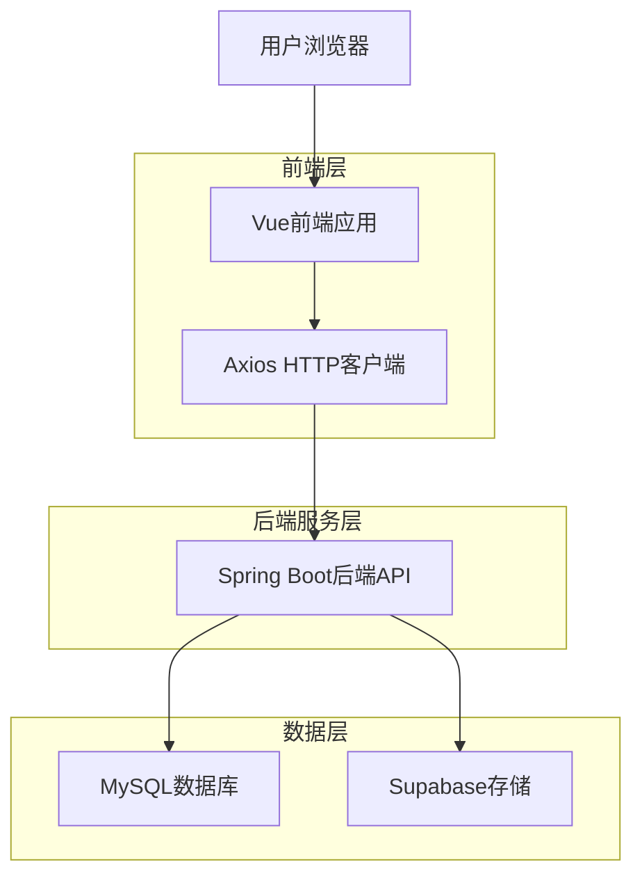
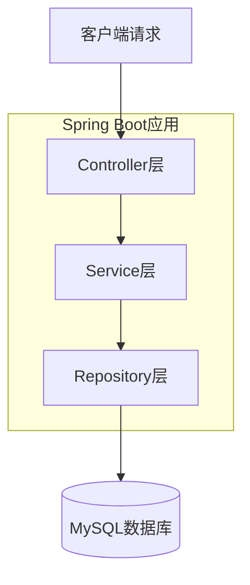
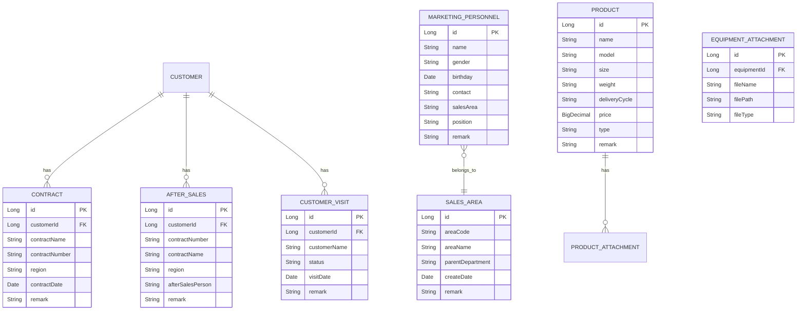

## 1. 架构设计



## 2. 技术描述
- 前端：Vue@3 + Element Plus + Vite
- 初始化工具：vite-init
- 后端：Spring Boot@2.7 + MyBatis Plus
- 数据库：MySQL@8.0
- 文件存储：Supabase Storage
- 认证：Spring Security + JWT

## 3. 路由定义
| 路由 | 用途 |
|-------|-------|
| / | 登录页面 |
| /home | 主页，显示系统导航 |
| /basicinfo/customer | 客户管理页面 |
| /basicinfo/customer/:id | 客户详情页面 |
| /basicinfo/sales-area | 销售片区管理页面 |
| /basicinfo/marketing-personnel | 营销人员管理页面 |
| /basicinfo/personnel-transfer | 人员调动管理页面 |
| /basicinfo/product | 产品管理页面 |
| /system/role | 角色管理页面 |
| /system/permission | 权限配置页面 |

## 4. API定义

### 4.1 客户管理API

#### 获取客户合同信息
```
GET /api/basicinfo/customer/{customerId}/contracts
```

响应参数：
| 参数名称 | 参数类型 | 描述 |
|----------|----------|------|
| id | Long | 合同ID |
| contractName | String | 合同名称 |
| contractNumber | String | 合同编号 |
| region | String | 区域 |
| contractDate | Date | 合同日期 |
| remark | String | 备注 |

#### 获取客户售后信息
```
GET /api/basicinfo/customer/{customerId}/after-sales
```

响应参数：
| 参数名称 | 参数类型 | 描述 |
|----------|----------|------|
| id | Long | 售后记录ID |
| contractNumber | String | 合同编号 |
| contractName | String | 合同名称 |
| region | String | 区域 |
| afterSalesPerson | String | 售后人员 |
| remark | String | 备注 |

#### 获取客户来访信息
```
GET /api/basicinfo/customer/{customerId}/visits
```

响应参数：
| 参数名称 | 参数类型 | 描述 |
|----------|----------|------|
| id | Long | 来访记录ID |
| customerId | Long | 客户ID |
| customerName | String | 客户名称 |
| status | String | 状态 |
| visitDate | Date | 来访日期 |
| remark | String | 备注 |

### 4.2 销售片区管理API

#### 获取片区列表
```
GET /api/basicinfo/sales-area
```

#### 创建片区
```
POST /api/basicinfo/sales-area
```

请求参数：
| 参数名称 | 参数类型 | 是否必需 | 描述 |
|----------|----------|----------|------|
| areaCode | String | 是 | 片区编号 |
| areaName | String | 是 | 片区名称 |
| parentDepartment | String | 是 | 上级部门 |
| createDate | Date | 否 | 创建日期 |
| remark | String | 否 | 备注 |

#### 更新片区
```
PUT /api/basicinfo/sales-area/{id}
```

#### 删除片区
```
DELETE /api/basicinfo/sales-area/{id}
```

### 4.3 营销人员管理API

#### 获取营销人员列表
```
GET /api/basicinfo/marketing-personnel
```

响应参数：
| 参数名称 | 参数类型 | 描述 |
|----------|----------|------|
| id | Long | 人员ID |
| name | String | 姓名 |
| gender | String | 性别 |
| birthday | Date | 生日 |
| contact | String | 联系方式 |
| salesArea | String | 所属片区 |
| position | String | 职务 |
| remark | String | 备注 |

#### 更新营销人员信息
```
PUT /api/basicinfo/marketing-personnel/{id}
```

请求参数：
| 参数名称 | 参数类型 | 是否必需 | 描述 |
|----------|----------|----------|------|
| name | String | 是 | 姓名 |
| gender | String | 是 | 性别 |
| birthday | Date | 否 | 生日 |
| contact | String | 是 | 联系方式 |
| salesArea | String | 是 | 所属片区 |
| position | String | 是 | 职务 |
| remark | String | 否 | 备注 |

### 4.4 人员调动管理API

#### 获取片区树结构
```
GET /api/basicinfo/personnel-transfer/area-tree
```

#### 获取片区人员列表
```
GET /api/basicinfo/personnel-transfer/area-personnel/{areaId}
```

#### 批量调动人员
```
POST /api/basicinfo/personnel-transfer/batch-transfer
```

请求参数：
| 参数名称 | 参数类型 | 是否必需 | 描述 |
|----------|----------|----------|------|
| personnelIds | List<Long> | 是 | 人员ID列表 |
| targetAreaId | Long | 是 | 目标片区ID |

### 4.5 产品管理API

#### 获取产品列表
```
GET /api/basicinfo/product/list?type={type}
```

请求参数：
| 参数名称 | 参数类型 | 是否必需 | 描述 |
|----------|----------|----------|------|
| type | String | 否 | 产品类型：SINGLE(单体设备)、SPARE(备品备件)、COMPLETE(设备成套) |

响应参数：
| 参数名称 | 参数类型 | 描述 |
|----------|----------|------|
| id | Long | 产品ID |
| name | String | 产品名称 |
| model | String | 型号 |
| size | String | 尺寸/参数 |
| weight | String | 重量 |
| deliveryCycle | String | 交货周期 |
| price | BigDecimal | 价格 |
| type | String | 产品类型 |
| attachments | List | 附件列表 |
| remark | String | 备注 |

#### 创建产品
```
POST /api/basicinfo/product
```

请求参数：
| 参数名称 | 参数类型 | 是否必需 | 描述 |
|----------|----------|----------|------|
| name | String | 是 | 产品名称 |
| model | String | 否 | 型号 |
| size | String | 否 | 尺寸/参数 |
| weight | String | 否 | 重量 |
| deliveryCycle | String | 否 | 交货周期 |
| price | BigDecimal | 否 | 价格 |
| type | String | 是 | 产品类型：SINGLE、SPARE、COMPLETE |
| attachments | List | 否 | 附件列表 |
| remark | String | 否 | 备注 |

#### 更新产品信息
```
PUT /api/basicinfo/product/{id}
```

#### 删除产品
```
DELETE /api/basicinfo/product/{id}
```

#### Excel导入产品
```
POST /api/basicinfo/product/import-excel
```

请求参数：
| 参数名称 | 参数类型 | 是否必需 | 描述 |
|----------|----------|----------|------|
| file | MultipartFile | 是 | Excel文件 |

## 5. 服务器架构



## 6. 数据模型

### 6.1 数据模型定义



### 6.2 数据定义语言

销售片区表（sales_area）
```sql
-- 创建表
CREATE TABLE sales_area (
    id BIGINT PRIMARY KEY AUTO_INCREMENT,
    area_code VARCHAR(50) NOT NULL COMMENT '片区编号',
    area_name VARCHAR(100) NOT NULL COMMENT '片区名称',
    parent_department VARCHAR(50) NOT NULL COMMENT '上级部门',
    create_date DATETIME DEFAULT CURRENT_TIMESTAMP COMMENT '创建日期',
    remark TEXT COMMENT '备注',
    created_at TIMESTAMP DEFAULT CURRENT_TIMESTAMP,
    updated_at TIMESTAMP DEFAULT CURRENT_TIMESTAMP ON UPDATE CURRENT_TIMESTAMP
);

-- 创建索引
CREATE INDEX idx_area_code ON sales_area(area_code);
CREATE INDEX idx_parent_department ON sales_area(parent_department);

-- 初始化数据
INSERT INTO sales_area (area_code, area_name, parent_department, remark) VALUES
('001', '上海片区', '成套处', '华东地区销售'),
('002', '北京片区', '外贸处', '华北地区销售'),
('003', '重庆片区', '销售处', '西南地区销售');
```

客户合同信息表（customer_contract）
```sql
CREATE TABLE customer_contract (
    id BIGINT PRIMARY KEY AUTO_INCREMENT,
    customer_id BIGINT NOT NULL,
    contract_name VARCHAR(200) NOT NULL COMMENT '合同名称',
    contract_number VARCHAR(100) NOT NULL COMMENT '合同编号',
    region VARCHAR(100) COMMENT '区域',
    contract_date DATE COMMENT '合同日期',
    remark TEXT COMMENT '备注',
    created_at TIMESTAMP DEFAULT CURRENT_TIMESTAMP,
    updated_at TIMESTAMP DEFAULT CURRENT_TIMESTAMP ON UPDATE CURRENT_TIMESTAMP,
    INDEX idx_customer_id (customer_id),
    INDEX idx_contract_number (contract_number)
);
```

客户售后信息表（customer_after_sales）
```sql
CREATE TABLE customer_after_sales (
    id BIGINT PRIMARY KEY AUTO_INCREMENT,
    customer_id BIGINT NOT NULL,
    contract_number VARCHAR(100) COMMENT '合同编号',
    contract_name VARCHAR(200) COMMENT '合同名称',
    region VARCHAR(100) COMMENT '区域',
    after_sales_person VARCHAR(100) COMMENT '售后人员',
    remark TEXT COMMENT '备注',
    created_at TIMESTAMP DEFAULT CURRENT_TIMESTAMP,
    updated_at TIMESTAMP DEFAULT CURRENT_TIMESTAMP ON UPDATE CURRENT_TIMESTAMP,
    INDEX idx_customer_id (customer_id)
);
```

客户来访信息表（customer_visit）
```sql
CREATE TABLE customer_visit (
    id BIGINT PRIMARY KEY AUTO_INCREMENT,
    customer_id BIGINT NOT NULL,
    customer_name VARCHAR(200) NOT NULL COMMENT '客户名称',
    status VARCHAR(50) COMMENT '状态',
    visit_date DATE COMMENT '来访日期',
    remark TEXT COMMENT '备注',
    created_at TIMESTAMP DEFAULT CURRENT_TIMESTAMP,
    updated_at TIMESTAMP DEFAULT CURRENT_TIMESTAMP ON UPDATE CURRENT_TIMESTAMP,
    INDEX idx_customer_id (customer_id),
    INDEX idx_visit_date (visit_date)
);
```

营销人员表（marketing_personnel）
```sql
CREATE TABLE marketing_personnel (
    id BIGINT PRIMARY KEY AUTO_INCREMENT,
    name VARCHAR(100) NOT NULL COMMENT '姓名',
    gender VARCHAR(10) NOT NULL COMMENT '性别',
    birthday DATE COMMENT '生日',
    contact VARCHAR(50) NOT NULL COMMENT '联系方式',
    sales_area VARCHAR(100) NOT NULL COMMENT '所属片区',
    position VARCHAR(50) NOT NULL COMMENT '职务',
    remark TEXT COMMENT '备注',
    created_at TIMESTAMP DEFAULT CURRENT_TIMESTAMP,
    updated_at TIMESTAMP DEFAULT CURRENT_TIMESTAMP ON UPDATE CURRENT_TIMESTAMP,
    INDEX idx_sales_area (sales_area),
    INDEX idx_position (position)
);

-- 初始化数据
INSERT INTO marketing_personnel (name, gender, birthday, contact, sales_area, position, remark) VALUES
('张三', '男', '1989-01-01', '13877777778', '上海片区', '营销人员', '华东区域销售'),
('王茹', '女', '1984-02-02', '13829394848', '北京片区', '营销人员', '华北区域销售');
```

产品表（product）
```sql
CREATE TABLE product (
    id BIGINT PRIMARY KEY AUTO_INCREMENT,
    name VARCHAR(200) NOT NULL COMMENT '产品名称',
    model VARCHAR(100) COMMENT '型号',
    size VARCHAR(100) COMMENT '尺寸/参数',
    weight VARCHAR(50) COMMENT '重量',
    delivery_cycle VARCHAR(50) COMMENT '交货周期',
    price DECIMAL(10,2) COMMENT '价格',
    type VARCHAR(20) NOT NULL COMMENT '产品类型：SINGLE(单体设备)、SPARE(备品备件)、COMPLETE(设备成套)',
    remark TEXT COMMENT '备注',
    created_at TIMESTAMP DEFAULT CURRENT_TIMESTAMP,
    updated_at TIMESTAMP DEFAULT CURRENT_TIMESTAMP ON UPDATE CURRENT_TIMESTAMP,
    INDEX idx_name (name),
    INDEX idx_model (model),
    INDEX idx_type (type)
);
```

产品附件表（product_attachment）
```sql
CREATE TABLE product_attachment (
    id BIGINT PRIMARY KEY AUTO_INCREMENT,
    product_id BIGINT NOT NULL COMMENT '产品ID',
    file_name VARCHAR(255) NOT NULL COMMENT '文件名称',
    file_path VARCHAR(500) NOT NULL COMMENT '文件路径',
    file_type VARCHAR(50) COMMENT '文件类型',
    created_at TIMESTAMP DEFAULT CURRENT_TIMESTAMP,
    INDEX idx_product_id (product_id),
    INDEX idx_file_type (file_type)
);
```